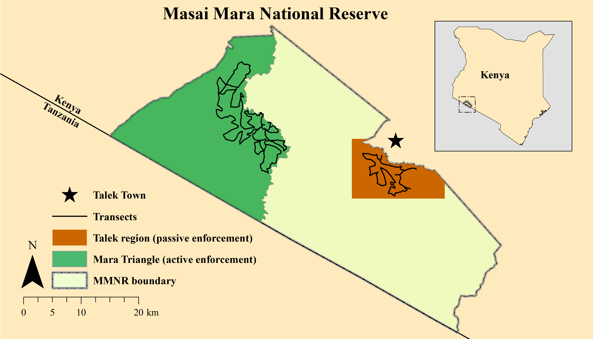

# Matthew T. Farr, David S. Green, Kay E. Holekamp, Gary J. Roloff, and Elise F. Zipkin

# Multi-species hierarchical modeling reveals variable responses of African carnivores to management alternatives

# Ecological Applications

# Simulation of winding survey bias

Straight line survey routes were infeasible due to impassible terrain and off-road restrictions; thus surveys were designed to maximize coverage of the Talek region and Mara Triangle (Figure 1).



**Figure S1.** Map of survey routes in the Talek and Mara Triangle management regions within the Masai Mara National Reserve, Kenya. Transect vehicle surveys were conducted at 4 to 6 week intervals from July 2012 to March 2014.

The curvatures of winding surveys do not violate the assumption of distance sampling or pose a serious issue to estimating detection probabilities (Hiby & Krishna 2001). However, winding surveys may violate the assumption of random placement, which ensures a representative sample of distances to observations for estimation of detection probability (Buckland et al. 1993). We conducted a simulation study to examine any biases created by winding surveys and to compare performance to straight surveys with random placement. We checked for biases in the scale parameter, $\sigma$, for detection probability, the number of groups within (i.e., Groups within) the sampling boundary (i.e., transect width of 1300 m), the abundance (derived from mean number of groups and mean group size) within the sampling boundary (i.e., Abundance within), the number of groups within the entire study region (i.e., Groups), and the abundance within the entire study region (i.e., Abundance).

To do this, we generate count data for a single species across the study region by simulating the location of groups assuming a uniform distribution for the intensity of groups. We then simulate group sizes for each group following the model in the main text. We sample from the simulated data using distance sampling with both winding and staight survey designs. We then compare the relative biases of the estimated parameters and the true parameters between winding and straight survey designs using a hierarchical distance sampling model (i.e., does not include a multi-species component).

We generated 100 datasets for simulating the locations of groups and group sizes and resampled each sampling design 10 times for a total of 1000 simulations for each sampling design. For each dataset, observations (groups not individuals) were distributed uniformly across the sampling area. Group sizes were then simulated for each group. Then each dataset of uniformly distributed observations was resampled 10 times. 

The results of the simulation study show that the winding survey is slightly more biased (8.87 % more biased) for the number of groups within the sampling boundary (i.e., Groups within) when compared to the straight survey (Table 1). 

**Table S1.** The mean relative biases (percent) for our 5 parameters of interest for the winding survey design and the straigh survey design when compared to the true values. 
```{r, comment=NA, echo=FALSE}
load(file = "summary.R")
round(summary, digits = 2)
```

This also holds true (winding surveys were 6.44% more biased) for the number of groups within the enitre study region (i.e., Groups). However, abundance within the sampling boundary (i.e., Abundance within) and for the entire study region (i.e., Abundance) were similar between the two survey methods, and there was no increase in bias for the scale parameter, $\sigma$, which influenced detection. We concluded that the winding survey design did not have a signifcant enough increase in bias to impact our results. Additionally, we assume that any potential biases caused by winding transects would have a similar influence in both management regions and would only affect absolute, but not relative, abundance estimates (summary of results, including the remaining tables and figures, are presented after the annotated code).

Below is the annotated code for the simulation study for a single simulation. To see complete code for the simulation study, please go to [GitHub](https://github.com/farrmt/HMSDS/blob/master/SupportingInformation/Simulation.R).

```{r set-opitions, echo=FALSE}
options(width = 100)
```

## Annotated code

Set seed
```{r}
set.seed(1985)
```

Load R packages
```{r results="hide", message=FALSE, warning=FALSE}
library(rgdal)
library(sp)
library(dplyr)
library(tidyr)
library(jagsUI)
```

Create study region UTM boundaries where individuals will be simulated
```{r}
#Easting UTM
xlim <- c(715304, 752393)

#Northing UTM
ylim <- c(9831970, 9857296)
```

Simulate true latent values
```{r}
#Number of groups
N <- 1000

#Simulate UTM coordinates of groups
u1 <- runif(N, xlim[1], xlim[2]) 
u2 <- runif(N, ylim[1], ylim[2])

#Group size
lambda.group <- 2
cs <- rpois(N, lambda.group) + 1

#Abundance
Ntotal <- sum(cs)

#Half normal scale parameter
sigma <- 300

#Mid point of each distance class
midpt <- seq(12.5, 650, 25)

#Index for distance class
nG <- length(midpt)

#Width of distance class
v <- 25

#Transect half width
B <- 650
```

Create winding sampling design
```{r results="hide"}
#Directory for sampling design shapefiles
d.dir <- "./Transects"

#Import transect shapefiles
Site1 <- readOGR(dsn = d.dir, layer = "Site1")
Site2 <- readOGR(dsn = d.dir, layer = "Site2")
Site3 <- readOGR(dsn = d.dir, layer = "Site3")
Site4 <- readOGR(dsn = d.dir, layer = "Site4")
Site5 <- readOGR(dsn = d.dir, layer = "Site5")
Site6 <- readOGR(dsn = d.dir, layer = "Site6")
Site7 <- readOGR(dsn = d.dir, layer = "Site7")
Site8 <- readOGR(dsn = d.dir, layer = "Site8")
Site9 <- readOGR(dsn = d.dir, layer = "Site9")
Site10 <- readOGR(dsn = d.dir, layer = "Site10")
Site11 <- readOGR(dsn = d.dir, layer = "Site11")
Site12 <- readOGR(dsn = d.dir, layer = "Site12")
Site13 <- readOGR(dsn = d.dir, layer = "Site13")
Site14 <- readOGR(dsn = d.dir, layer = "Site14")
Site15 <- readOGR(dsn = d.dir, layer = "Site15")
Site16 <- readOGR(dsn = d.dir, layer = "Site16")
Site17 <- readOGR(dsn = d.dir, layer = "Site17")
```

```{r, echo=FALSE}
par(mar=rep(0.25,4))
plot(x=NULL, y=NULL, xlim=xlim, ylim=ylim, 
     yaxt = "n", xaxt = "n", ylab = "", xlab = "")
plot(Site1, add=T, col="red")
plot(Site2, add=T, col="darkorange")
plot(Site3, add=T, col="gold")
plot(Site4, add=T, col="darkolivegreen2")
plot(Site5, add=T, col="forestgreen")
plot(Site6, add=T, col="aquamarine")
plot(Site7, add=T, col="cadetblue3")
plot(Site8, add=T, col="cornflowerblue")
plot(Site9, add=T, col="blue")
plot(Site10, add=T, col="blueviolet")
plot(Site11, add=T, col="darkmagenta")
plot(Site12, add=T, col="deeppink4")
plot(Site13, add=T, col="darkred")
plot(Site14, add=T, col="black")
plot(Site15, add=T, col="coral2")
plot(Site16, add=T, col="brown")
plot(Site17, add=T, col="grey")
```
**Figure S2.** Imported transect shapefiles for the winding survey. Each of the 17 transects is represented by a different color.

Sample coordintaes from transect. Used to calculate distances of observed groups.
```{r}
s1p <- spsample(Site1, 30, type = "regular")
s2p <- spsample(Site2, 30, type = "regular")
s3p <- spsample(Site3, 30, type = "regular")
s4p <- spsample(Site4, 30, type = "regular")
s5p <- spsample(Site5, 30, type = "regular")
s6p <- spsample(Site6, 30, type = "regular")
s7p <- spsample(Site7, 30, type = "regular")
s8p <- spsample(Site8, 30, type = "regular")
s9p <- spsample(Site9, 30, type = "regular")
s10p <- spsample(Site10, 30, type = "regular")
s11p <- spsample(Site11, 30, type = "regular")
s12p <- spsample(Site12, 30, type = "regular")
s13p <- spsample(Site13, 30, type = "regular")
s14p <- spsample(Site14, 30, type = "regular")
s15p <- spsample(Site15, 30, type = "regular")
s16p <- spsample(Site16, 30, type = "regular")
s17p <- spsample(Site17, 30, type = "regular")
```

Combine site coordinates
```{r}
#Easting
X <- c(s1p@coords[,1], s2p@coords[,1], s3p@coords[,1], s4p@coords[,1], 
       s5p@coords[,1], s6p@coords[,1], s7p@coords[,1], s8p@coords[,1],
       s9p@coords[,1], s10p@coords[,1], s11p@coords[,1], s12p@coords[,1],
       s13p@coords[,1], s14p@coords[,1], s15p@coords[,1], s16p@coords[,1],
       s17p@coords[,1])

#Northing
Y <- c(s1p@coords[,2], s2p@coords[,2], s3p@coords[,2], s4p@coords[,2], 
       s5p@coords[,2], s6p@coords[,2], s7p@coords[,2], s8p@coords[,2],
       s9p@coords[,2], s10p@coords[,2], s11p@coords[,2], s12p@coords[,2],
       s13p@coords[,2], s14p@coords[,2], s15p@coords[,2], s16p@coords[,2],
       s17p@coords[,2])
```

```{r, echo=FALSE}
par(mar=rep(0.25,4))
plot(x=NULL, y=NULL, xlim=xlim, ylim=ylim, 
     yaxt = "n", xaxt = "n", ylab = "", xlab = "")
points(cbind(X, Y), pch = ".")
```
**Figure S3.** Breaking continous winding survey into discrete points for calculation of distance from observation to transect.


Initialize values
```{r}
#Index for sites
nsites <- 17

#Index for transect points
J <- length(X)

#ID for sites
si <- seq(0, J, (J/nsites))

#ID for distance class
di <- seq(0,650,25)

#Minimum distance value
dst <- rep(NA, N)

#ID for nearest site
q <- rep(NA, N)

#Site
site <- rep(NA, N)

#Distance value to each transect point
d <- array(NA, dim = c(N, J))

#ID for groups less than 650 meters
y <- rep(NA, N)

#Index recorder
index <- rep(NA, N)
```

Simulate distances and site of groups
```{r}
for(i in 1:N){
  for(j in 1:J){
    
    #Distance from each group to each point on the transect
    d[i,j] <- sqrt((u1[i] - X[j])^2 + (u2[i] - Y[j])^2)
  }
  
  #Distance to nearest point on the transect
  dst[i] <- min(d[i,])
  
  #Index of which point in 1:J is the nearest
  q[i] <- which.min(d[i,])
  
  for(j in 1:nsites){
    
    #Determine the site for each group
    if(si[j] < q[i] && q[i] <= si[j+1])
      site[i] <- j
  }
  
  #Index of which observation are within 650 meters of transect
  if(dst[i] < 650)
    y[i] <- 1
  index[i] <- i
}
```

Harvest simulated data
```{r}
#Dataframe that includes information on all groups
Dtot <- cbind(y, index, u1, u2, site, cs)

#Dataframe containing only groups within 650 meters to transect
Din <- Dtot[complete.cases(Dtot),]

#Number of groups within 650 meters
Nin <- length(Din[,1])

#Abundance within 650 meters
Nintotal <- sum(Din[,6])
```

Initialize data
```{r}
#Remove groups not within 650 meters
index <- index[y==1]
index <- index[!is.na(index)]

#Detection Probability
p <- NULL

#Number of captured ("detected") groups
ncap <- rep(NA, Nin)

#Distance Class
dclass <- rep(NA, Nin)
```

Simulate detection of groups less than 650 meters
```{r}
for(i in 1:Nin){
  
  #Detection probability using half-normal distance function
  p[i] <- exp(-dst[index[i]] * dst[index[i]] / (2 * sigma * sigma))
  
  #Simulate number of groups detected
  ncap[i] <- rbinom(1, 1, p[i])
  
  for(k in 1:nG){
    
    #Determine distance class for each group
    if(di[k] < dst[index[i]] && dst[index[i]] <= di[k+1])
      dclass[i] <- k
  }
}
```

Harvest simulated data
```{r}
#Add distance class, detection probability, and detection index to dataframe
Din <- cbind(Din[,2:6],dclass, p, ncap)

#Undetected groups as NAs
for(i in 1:Nin){
  if(Din[i,8] == 0)
    Din[i,8] <- NA
}

#Dataframe of detected inidividuals
Dcap <- Din[complete.cases(Din),]

#Create observed number of groups per site
y.new <- table(Dcap[,4])
y.new <- as.data.frame(y.new)
colnames(y.new) <- c("site", "freq")
y.new$site <- as.integer(y.new$site)
y.new <- tbl_df(y.new)

#Add in sites with no detections
miss <- y.new %>% expand(site = 1:nsites)
miss$freq <- rep(0, length(miss))

#Add missing sites into observed groups per site
yobs <- full_join(y.new, miss, by = "site")
yobs <- yobs %>% arrange(site)
yobs <- as.numeric(yobs$freq.x)
yobs[is.na(yobs)] <- 0

#Site index for observed number of groups
site <- Dcap[,4]

#Distance class index for observed number of groups
dclass <- Dcap[,6]

#Number of observations
nobs <- sum(yobs)

#Group size
gs <- Dcap[,5]
```

Create offset for sites with longer transects and sampling area
```{r}
#Search area (meters squared) of each site
A.site <- as.vector(c(11.6542, 11.9619, 12.4702, 12.5182, 10.7843, 10.2384, 10.7495, 
                      12.0545, 9.0114, 11.2589, 10.4075, 9.7834, 11.8226, 10.5295,
                      11.5376, 14.8511, 14.0352))
```

JAGS Model
```{r}
cat("
    model{ 
    
    ##Priors
    
    for(j in 1:nsites){
    
    #Abundance prior
    alpha[j] ~ dnorm(0, 0.01)
    
    #Detection prior
    sigma[j] ~ dunif(0, 500)
    
    }#End j loop

    #OVerdispersion prior
    r.N ~ dunif(0,100) 
    r.G ~ dunif(0,100)
    
    #Group size prior
    beta ~ dunif(0, 50)
    
    ##Likelihood
    
    #Multinomial detection component
    for(i in 1:nobs){
    
    dclass[i] ~ dcat(fc[1:nG, site[i]])
    
    }#End i loop
    
    for(j in 1:nsites){
    
    #Construct cell probabilities for nG cells
    for(k in 1:nG){  
    
    #Half normal detection function at midpt (length of rectangle)
    p[k,j] <- exp(- midpt[k] * midpt[k] / (2 * sigma[j] * sigma[j])) 
    
    #Probability of x in each interval (width of rectangle)
    pi[k,j] <- v/B 
    
    #Detection probability for each interval (area of each rectangle)
    f[k,j] <- p[k,j] * pi[k,j] 
    
    #Conditional detection probability (scale to 1)
    fc[k,j] <- f[k,j] / pcap[j] 
    
    }#End k loop
    
    #Detection probability at each site (sum of rectangles)
    pcap[j] <- sum(f[1:nG,j])               
    
    #Observation process
    y[j] ~ dbin(pcap[j], N[j])
    
    #Description of latent number of groups (negative binomial)
    N[j] ~ dpois(lambda.star[j])

    #Expected Number of Groups
    lambda.star[j] <- rho[j] * lambda[j]

    #Overdispersion parameter for Expected Number of Groups
    rho[j] ~ dgamma(r.N, r.N)
    
    #Linear model for number of groups
    lambda[j] <- exp(alpha[j] + log(offset[j]))

    #Expected Group Size
    gs.lam.star[j] <- gs.lam[j] * gs.rho[j]
    
    #Overdispersion parameter for Expected Group Size
    gs.rho[j] ~ dgamma(r.G, r.G)

    #Group size
    gs.lam[j] <- exp(beta)
    
    }#End j loop
    
    for(i in 1:nobs){
    
    gs[i] ~ dpois(gs.lam.star[site[i]]) T(1,)
    
    }#End i loop
    
    ##Derived quantities
    
    #Number of groups within sampling boundary
    Nin <- sum(N[1:nsites])
    
    for(j in 1:nsites){
    
    #Abundance at each transect
    Ntotal[j] <- lambda.star[j] * gs.lam.star[j]
    
    } #End j loop
    
    #Abundance within sampling boundary
    Nintotal <- sum(Ntotal[])
    
    #Proportion of study region covered by sampling design
    D <- (939.316/164.4837)
    
    #Number of groups in entire study region
    Nwinding <- Nin * D
    
    #Abundance in entire study region
    Nwindingtotal <- Nintotal * D

    }",fill=TRUE, file="HMSDS_model.txt")
```

Compile JAGS data
```{r}
#Input data
str(windingD <- list(nG = nG, v = v, site = site, y = yobs, B = B, midpt = midpt,
                 nobs = nobs, dclass = dclass, nsites = nsites, 
                 gs = gs, offset = A.site))


#Initial values
N.in <- yobs + 1

inits <- function(){list(N = N.in, sigma = runif(17, 50, 350))} 

#Parameters to monitor
params<-c('sigma', 'Nin', 'Nintotal', 'Nwinding', 'Nwindingtotal')

#MCMC settings

nc <- 3
ni <- 12000
nb <- 2000
nt <- 4
```

Run model
```{r, message=FALSE, results="hide"}
windingM <- jags(data = windingD, model.file = "HMSDS_model.txt",
                 inits = inits, parameters.to.save = params, 
             n.chains = nc, n.iter = ni, n.burnin = nb, n.thin = nt)
```

Save and remove data for next sampling
```{r}
windingVals <- list(cbind(Din[,2], Din[,3]), cbind(Dcap[,2], Dcap[,3]), Nin, Nintotal)

rm(X, Y, nsites, J, si, di, dclass, dst, q, 
   site, d, y, index, Dtot, Din, Nin, Nintotal,
   p, ncap, Dcap, y.new, miss, yobs, nobs, gs,
   N.in, inits)
```

Create straight sampling design. There are 10 transects that run north to south.
```{r}
#Sampling area middle UTM coordinate
mdE <- 733848.5
mdN <- 9844633

#Sampling area left corner UTM coordinate
Et <- mdE - (13000/2)
Nt <- mdN + (12650/2)

#Sample points from straight transects
Ep <- seq((Et + 650), (Et + (13000 - 650)), 1300)
Np <- seq(Nt, (Nt - 12650), -253)
X <- rep(Ep, rep(length(Np), length(Ep)))
Y <- rep(Np, length(Ep))
```

```{r, echo=FALSE}
par(mar=rep(0.25,4))
plot(x=NULL, y=NULL, xlim=xlim, ylim=ylim, 
     yaxt = "n", xaxt = "n", ylab = "", xlab = "")
points(cbind(X,Y), col = "blue", pch = ".")
```
**Figure S4.** Transects for straight survey design that have been discretized into points for distance sampling calculations.

Initialize values
```{r}
#Index for sites
nsites <- 10

#Index for transect points
J <- length(X)

#ID for sites
si <- seq(0, J, (J/nsites))

#ID for distance class
di <- seq(0,650,25)

#Minimum distance value
dst <- rep(NA, N)

#ID for nearest site
q <- rep(NA, N)

#Site
site <- rep(NA, N)

#Distance value to each transect point
d <- array(NA, dim = c(N, J))

#ID for groups less than 650 meters
y <- rep(NA, N)

#Index recorder
index <- rep(NA, N)
```

Simulate data for distances and site for groups
```{r}
for(i in 1:N){
  for(j in 1:J){
    
    #Distance from each group to each point on the transect
    d[i,j] <- sqrt((u1[i] - X[j])^2 + (u2[i] - Y[j])^2)
  }
  
  #Distance to nearest point on the transect
  dst[i] <- min(d[i,])
  
  #Index of which point in 1:J is the nearest
  q[i] <- which.min(d[i,])
  
  for(j in 1:nsites){
    
    #Determine the site for each group
    if(si[j] < q[i] && q[i] <= si[j+1])
      site[i] <- j
  }
  
  #Index of which observation are within 650 meters of transect
  if(dst[i] < 650)
    y[i] <- 1
  index[i] <- i
}
```

Harvest simulated data
```{r}
#Dataframe that includes information on all groups
Dtot <- cbind(y, index, u1, u2, site, cs)

#Dataframe containing only groups within 650 meters to transect
Din <- Dtot[complete.cases(Dtot),]

#Number of groups within 650 meters
Nin <- length(Din[,1])

#Abundance within 650 meters
Nintotal <- sum(Din[,6])
```

Initialize data
```{r}
#Remove groups not within 650 meters
index <- index[y==1]
index <- index[!is.na(index)]

#Detection Probability
p <- NULL

#Number of captured ("detected") groups
ncap <- rep(NA, Nin)

#Distance Class
dclass <- rep(NA, Nin)
```

Simulate detection of groups less than 650 meters
```{r}
for(i in 1:Nin){
  
  #Detection probability using half-normal distance function
  p[i] <- exp(-dst[index[i]] * dst[index[i]] / (2 * sigma * sigma))
  
  #Simulate number of groups detected
  ncap[i] <- rbinom(1, 1, p[i])
  
  for(k in 1:nG){
    
    #Determine distance class for each group
    if(di[k] < dst[index[i]] && dst[index[i]] <= di[k+1])
      dclass[i] <- k
  }
}
```

Harvest simulated data
```{r}
#Add distance class, detection probability, and detection index to dataframe
Din <- cbind(Din[,2:6],dclass, p, ncap)

#Undetected groups as NAs
for(i in 1:Nin){
  if(Din[i,8] == 0)
    Din[i,8] <- NA
}

#Dataframe of detected inidividuals
Dcap <- Din[complete.cases(Din),]

#Create observed number of groups per site
y.new <- table(Dcap[,4])
y.new <- as.data.frame(y.new)
colnames(y.new) <- c("site", "freq")
y.new$site <- as.integer(y.new$site)
y.new <- tbl_df(y.new)

#Add in sites with no detections
miss <- y.new %>% expand(site = 1:nsites)
miss$freq <- rep(0, length(miss))

#Add missing sites into observed groups per site
yobs <- full_join(y.new, miss, by = "site")
yobs <- yobs %>% arrange(site)
yobs <- as.numeric(yobs$freq.x)
yobs[is.na(yobs)] <- 0

#Site index for observed number of groups
site <- Dcap[,4]

#Distance class index for observed number of groups
dclass <- Dcap[,6]

#Number of observations
nobs <- sum(yobs)

#Group size
gs <- Dcap[,5]
```

Compile JAGS data. Reuse JAGS model, parameters to save, and MCMC settings.
```{r}
#Input data
str(altD <- list(nG = nG, v = v, site = site, y = yobs, B = B, midpt = midpt,
                 nobs = nobs, dclass = dclass, nsites = nsites, 
                 gs = gs, offset = rep(1, nsites)))

#Initial values
N.in <- yobs + 1

inits <- function(){list(N = N.in, sigma = runif(10, 50, 350))}
```

Run JAGS model
```{r, message=FALSE, results="hide"}
altM <- jags(data = altD, model.file = "HMSDS_model.txt",
             inits = inits, parameters.to.save = params, 
             n.chains = nc, n.iter = ni, n.burnin = nb, n.thin = nt)
```

Save and remove data
```{r}
altVals <- list(cbind(Din[,2], Din[,3]), cbind(Dcap[,2], Dcap[,3]), Nin, Nintotal,
                cbind(X, Y))

rm(X, Y, nsites, J, si, di, dclass, dst, q, 
   site, d, y, index, Dtot, Din, Nin, Nintotal,
   p, ncap, Dcap, y.new, miss, yobs, nobs, gs,
   N.in, inits)
```

Absoulte relative bias estimates
```{r}
bias <- t(matrix(data = c(

#Number of groups in search area

#Winding True
windingVals[[3]],

#Winding Estimate
windingM$mean$Nin,

#Winding Bias
(abs(mean((windingM$sims.list$Nin - windingVals[[3]])/windingVals[[3]])) * 100),

#Straight True
altVals[[3]],

#Straight Estimate
altM$mean$Nin,

#Straight Bias
(abs(mean((altM$sims.list$Nin - altVals[[3]])/altVals[[3]])) * 100),

#Abundance in search area

#Winding True
windingVals[[4]],

#Winding Estimate
windingM$mean$Nintotal,

#Winding Bias
(abs(mean((windingM$sims.list$Nintotal - windingVals[[4]])/windingVals[[4]])) * 100),

#Straight True
altVals[[4]],

#Straight Estimate
altM$mean$Nintotal,

#Straight Bias
(abs(mean((altM$sims.list$Nintotal - altVals[[4]])/altVals[[4]])) * 100),

#Number of groups in survey boundary

#Winding True
N,

#Winding Estimate
windingM$mean$Nwinding,

#Winding Bias
(abs(mean((windingM$sims.list$Nwinding - N)/N)) * 100),

#Straight True
N,

#Straight Estimate
altM$mean$Nwinding,

#Straight Bias
(abs(mean((altM$sims.list$Nwinding - N)/N)) * 100),

#Abundance in survey boundary

#Winding True
Ntotal,

#Winding Estimate
windingM$mean$Nwindingtotal,

#Winding Bias
(abs(mean((windingM$sims.list$Nwindingtotal - Ntotal)/Ntotal)) * 100),

#Straight True
Ntotal,

#Straight Estimate
altM$mean$Nwindingtotal,

#Straight Bias
(abs(mean((altM$sims.list$Nwindingtotal - Ntotal)/Ntotal)) * 100),

#Scale parameter

#Winding True
sigma,

#Winding Estimate
mean(windingM$mean$sigma),

#Winding Bias
(abs(mean((rowMeans(windingM$sims.list$sigma) - sigma)/sigma)) * 100),

#Straight True
sigma,

#Straight Estimate
mean(altM$mean$sigma),

#Straight Bias
(abs(mean((rowMeans(altM$sims.list$sigma) - sigma)/sigma)) * 100)),

nrow = 6, ncol = 5))

colnames(bias) <- c("Winding True", "Winding Est", "Winding Bias", 
                    "Straight True", "Straight Est", "Straight Bias" )
rownames(bias) <- c("Groups Within", "Abundance Within",
                    "Groups", "Abundance", "Sigma")
```

## Results

**Table S2.** Estimates from winding survey model.
```{r, out.width=100, comment=NA, echo=FALSE}
windingM$summary[,1:8]
```

```{r, echo=FALSE}
par(mar=rep(0.25,4))
plot(x=NULL, y=NULL, xlim=xlim, ylim=ylim, 
     yaxt = "n", xaxt = "n", ylab = "", xlab = "")
plot(Site1, add=T, col="red")
plot(Site2, add=T, col="darkorange")
plot(Site3, add=T, col="gold")
plot(Site4, add=T, col="darkolivegreen2")
plot(Site5, add=T, col="forestgreen")
plot(Site6, add=T, col="aquamarine")
plot(Site7, add=T, col="cadetblue3")
plot(Site8, add=T, col="cornflowerblue")
plot(Site9, add=T, col="blue")
plot(Site10, add=T, col="blueviolet")
plot(Site11, add=T, col="darkmagenta")
plot(Site12, add=T, col="deeppink4")
plot(Site13, add=T, col="darkred")
plot(Site14, add=T, col="black")
plot(Site15, add=T, col="coral2")
plot(Site16, add=T, col="brown")
plot(Site17, add=T, col="grey")
points(cbind(u1, u2), col = "black", lwd = 1)
points(windingVals[[1]], col = "green")
points(windingVals[[2]], col = "red", pch = 20)
```
**Figure S5.** Visualization of winding survey. Black circles indicate simulated observations not within sampling boundary. Green circles with no fill indicate observations within sampling boundary that were not detected. Green circles with red fill indicate observations within sampling boundary that were detected.


**Table S3.** Estimates from straight survey model.
```{r, comment=NA, echo=FALSE}
altM$summary[,1:8]
```

```{r, echo=FALSE}
par(mar=rep(0.25,4))
plot(x=NULL, y=NULL, xlim=xlim, ylim=ylim, 
     yaxt = "n", xaxt = "n", ylab = "", xlab = "")
points(cbind(u1, u2), col = "black", pch = 20)
points(altVals[[5]], col = "blue", pch = ".")
points(altVals[[1]], col = "green")
points(altVals[[2]], col = "red", pch = 20)
```
**Figure S6.** Visualization of straight survey. Black circles indicate simulated observations not within sampling boundary. Green circles with no fill indicate observations within sampling boundary that were not detected. Green circles with red fill indicate observations within sampling boundary that were detected.


**Table S4.** Estimated and true values with associated relative bias for winding and straight surveys for a single dataset.
```{r, out.width=100, comment=NA, echo=FALSE}
bias
```

## Literature Cited

Buckland, S.T., Anderson, D.R., Burnham, K.P. & Laake, J.L. (1993) Distance Sampling: Estimating Abundance of Biological Populations. Oxford University Press, Oxford.

Hiby, L. & Krishna, M.B. (2001) Line transect sampling from a curving path. Biometrics, 57, 727-731.